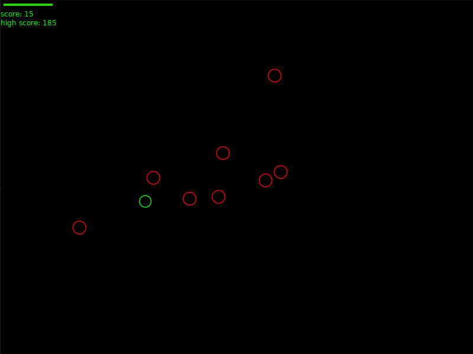
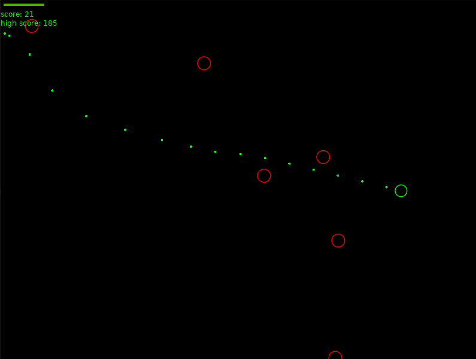
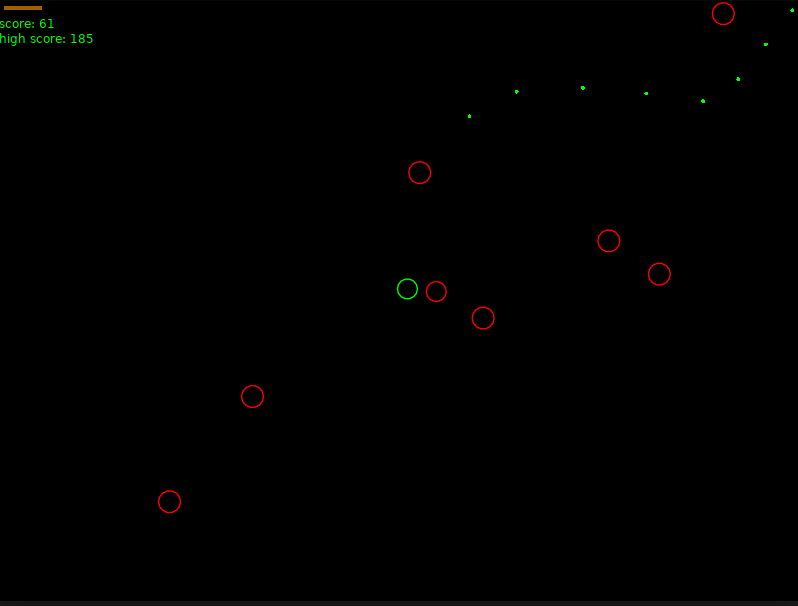

# Top Down Shooter
Top Down Shooter (TDS) is a rudimentary top down shooter game using the [love2d](https://love2d.org) Lua game engine and some elbow grease.

## Controls
* Use the `w`, `a`, `s`, and `d` keys to move the player character
* Use the `left mouse` button to shoot with your pistol
* Use the `escape` key to quit the game

## Winning
* There is no winning, this game goes on until you either quit or die.

## Issues
* If you discover any bugs please submit an issue.

# Screenshots

# Download
Releases are archived into a .love file in the releases page. To run the game, simply download the latest release and run with [love2d](https://love2d.org).
